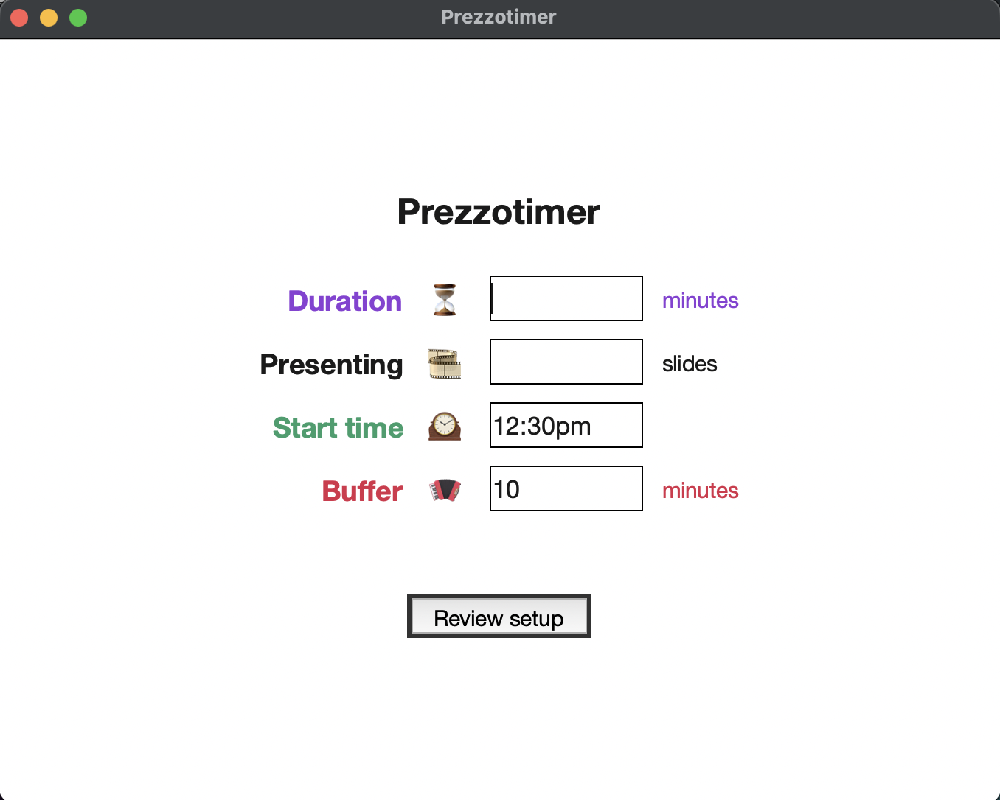
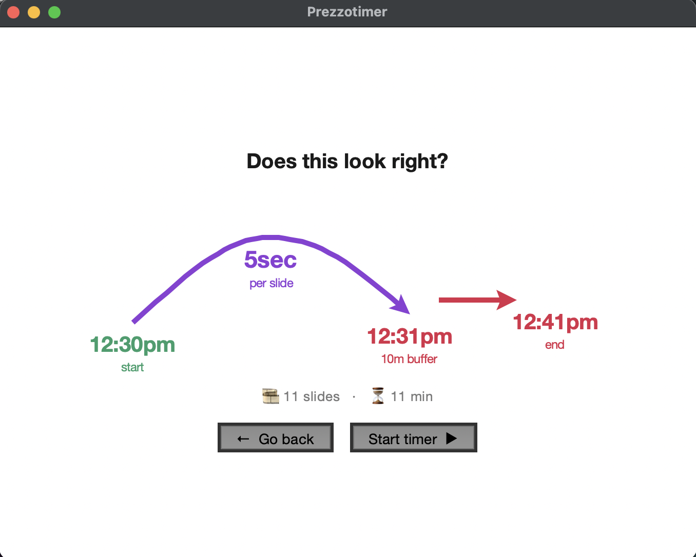

# PREZZOTIMER ⏰ 🤔

This project is for people who give presentations with lots of slides and want to avoid running overtime.

This python app shows you the target slide number which you can compare to the actual slide number so you can speed up or slow down your presentation.

 

## My problem:
I believe in the concept of [one-idea-per-slide](https://www.youtube.com/shorts/qKDvUO-hK5s). I run a [workshop](https://lu.ma/nascent) where I present ~250 slides over 2 hours, interspersed with lots of audience participation. So it's easy for the workshop to run long, but I want to respect my audience's time and keep to the planned 2 hours. So far, I've been [keeping time by manually](IMG_0532.jpeg) writing out a table of time on the clock and target slide number, which I then compare to the current slide. This is tedious and distracts from the preso.

I wanna build "an app for that".

## Run it

Needs Python 3 with tkinter, and nothing else — no pip install, no dependencies beyond the standard library.

```
git clone https://github.com/mikimer/prezzotimer.git
cd prezzotimer
python3 prezzotimer.py
```

tkinter ships with the python.org installers and with Anaconda. If you installed Python through Homebrew you may need `brew install python-tk` first.

## How it works

Three screens: setup, confirmation, timer.

### 1. Setup

| Field | What it means |
|---|---|
| ⏳ Duration | the whole session, wall clock — start to hard finish |
| 🎞️ Presenting | total slides in the deck |
| 🕰️ Start time | when you begin. Accepts `2:30pm`, `1430`, `14:00`, `2.30` |
| 🪗 Buffer | minutes held back at the end for Q&A and wrap-up |

Duration and slides start empty on purpose. Start time and buffer are pre-filled, because those are close enough to the same every time to be worth a head start.

So duration 80 with a 10 minute buffer means: pace the deck across 70 minutes, land the last slide at the 70 minute mark, and finish for real at 80.

### 2. Confirmation

Before the timer starts, the app draws your setup as a timeline: start time, seconds per slide, when the last slide lands, the buffer, and the hard end.

The seconds-per-slide number is the point of this screen. Duration and slides are both just numbers, so swapping them looks perfectly fine in the input fields — but 24 seconds per slide and 2 minutes per slide do not look the same at all. If the arc says something absurd, go back and fix it.

### 3. Timer

One big number: the slide you should be on right now. Compare it to where you actually are and speed up or slow down.

If your start time is still in the future, the screen counts down to it. **Start now** skips that countdown and goes straight to the live display without moving your schedule — the target slide just sits at 1 until your real start time arrives, so you still finish when you planned to.

## Why there's a confirmation screen

I built this when my workshop deck was stable, then didn't use it for six months. Next time I ran it I had a brand-new deck, typed the slide count into the duration field, and didn't notice until I was mid-presentation. Sporadic use plus a new deck every time means there's no muscle memory to catch a wrong number, so the setup has to be checked rather than trusted.

## Details

- Smart time input: accepts start times in many formats, including `2pm`, `2:30pm`, `14:00`, `1400`, `2.20` and `14.20`.
- Waiting screen: if the start time is in the future, the app shows the current time and a countdown until the presentation begins.
- All times are shown in 12-hour am/pm format.
- Input validation: the app checks for valid numbers and makes sure the buffer is less than the duration, and tells you which field is wrong.

## Future development

I use Google Presentations so I could try to link this app to gPreso so it would automatically see which slide I'm on and provide more useful feedback.

The timer should be large (full screen) when I'm giving an in-person workshop and small (ideally in the Menu Bar) for on-line webinars.

Assume: [screen extension, not display mirroring](Mac-External-Displays-Arrangment.jpg) during in-person workshops.
