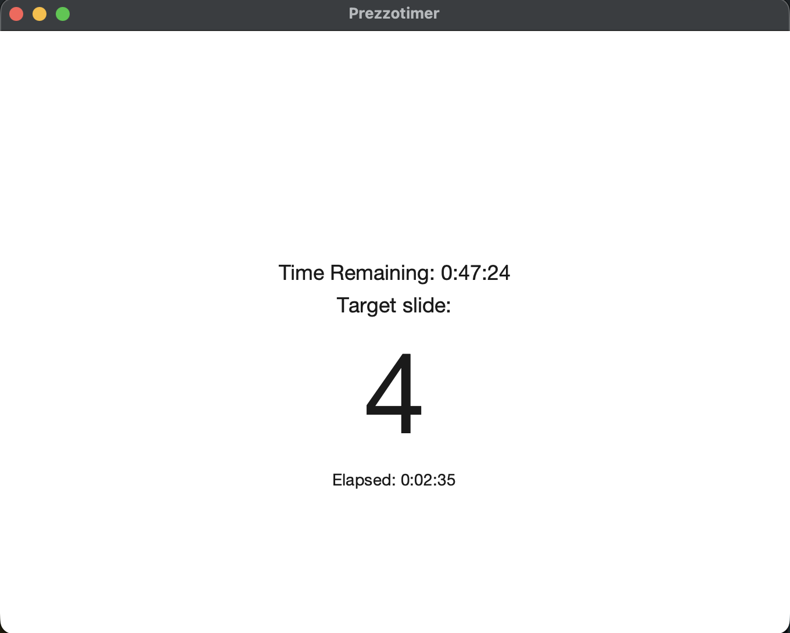

# PREZZOTIMER ⏰ 🤔

Shows the slide number you *should* be on, so a big deck doesn't run overtime.

  

## Run it

Python 3 with tkinter. No other dependencies.

```
git clone https://github.com/mikimer/prezzotimer.git
cd prezzotimer
python3 prezzotimer.py
```

Homebrew Python may need `brew install python-tk` first.

## Using it

| Field | |
|---|---|
| ⏳ Duration | the whole session, wall clock |
| 🎞️ Presenting | total slides |
| 🕰️ Start time | `2:30pm`, `1430`, `14:00` and `2.30` all work |
| 🪗 Buffer | minutes held back at the end for Q&A |

Duration includes the buffer — 80 minutes with a 10 minute buffer paces the deck across 70 and ends at 80.

Next screen draws it as a timeline. **Check the seconds per slide.** Duration and slides are both just numbers, so swapping them looks fine in the fields, but 24 sec/slide and 2 min/slide don't.

Then the timer: one big number, the slide you should be on right now. **Start now** skips the countdown without moving your finish time.

## My problem

I believe in [one-idea-per-slide](https://www.youtube.com/shorts/qKDvUO-hK5s). I run a [workshop](https://lu.ma/nascent) where I present ~250 slides over 2 hours with lots of audience participation, so it's easy to run long — and I want to respect my audience's time. I used to keep time by [hand-writing a table](IMG_0532.jpeg) of clock time vs. target slide. Tedious, and it distracts from the preso.

I wanna build "an app for that".

## Future

Link to Google Slides so it knows which slide I'm actually on. Full screen for in-person workshops, Menu Bar for webinars. Assumes [screen extension, not mirroring](Mac-External-Displays-Arrangment.jpg).
